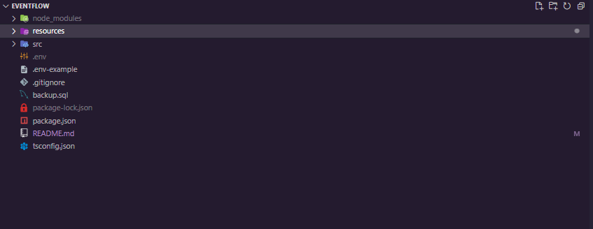
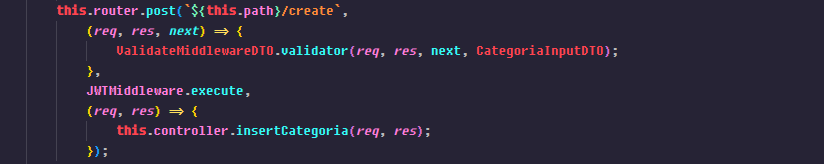

# Alquileres MongoDB

## Descripción del proyecto:
#### Proyecto que contiene el Back-end para un aplicativo de gestión de alquileres, a través del cual se pueden administrar las distintas entidades que lo contienen.

---

## Técnologías utilizadas:
#### Para este proyecto se utilizó el entorno de ejecución **NodeJS** con su framework [ExpressJS](https://expressjs.com/). Para la base de datos se utilizó **MongoDB**, también se utilizaron librerías como [class-transformer](https://github.com/typestack/class-transformer) y [class-validator](https://github.com/typestack/class-validator) para validaciones y dto, por otro lado se implemento JWT con la librería [jose](https://www.npmjs.com/package/jose) en conjunto con sesiones con la librería [express-session](https://www.npmjs.com/package/express-session) todo el código está en **TypeScript** para proporcionar un tipado estático.
##### (El resto de dependencias se podrán visualizar en el archivo package.json que en su mayoría son de desarrollo ya que las necesarias para producción son las que se acabaron de mencionar.)

---

## Estructura y Configuración:
### **Directorio Raíz:**
#### En el directorio raíz se encuentran los archivos principales de configuración sin entrar aún al código.

#### 

- #### La carpeta [node_modules](node_modules) es la que se creará al inicializar el proyecto y contiene todas los archivos necesarios para las dependencias que se vayan a utilizar.

- #### La carpeta [src](src) contiene todo el código del proyecto.

- #### El archivo .env-example es el que se utilizará más adelante para configurar las variables de entorno.

- #### El archivo [package.json](package.json) al igual que la carpeta [node_modules](node_modules) se creará automáticamente al inicializar el proyecto y aqui se podrán realizar configuraciones del mismo y de las dependencias que este contiene.

- #### El archivo [tsconfig.json](tsconfig.json) es el archivo que contiene todas las configuraciones necesaarias para que **TypeScript** funcione correctamente.

### **Carpeta del proyecto ([src](src)):**


- `index.ts`: Archivo principal que inicializa la aplicación y configura las rutas.
- `app.ts`: Archivo que configura la aplicación Express y inicializa las rutas y middlewares.
- `common/`: Carpeta que contiene funciones comunes y una clase de enrutador común.
- `config/`: Carpeta que contiene archivos de configuración, como `ConnectDataSource.ts` para la conexión a la base de datos y `EnvConfig.ts` para las variables de entorno.
- `controllers/`: Carpeta que contiene los controladores de cada entidad, como `CitasController.ts`.
- `db/`: Carpeta que contiene la lógica de conexión a la base de datos y el manejo del datasource, como `Connection.ts` y `DataSource.ts`.
- `interfaces/`: Carpeta que contiene las interfaces utilizadas en el proyecto, como `RoutesInterface.ts`.
- `middlewares/`: Carpeta que contiene los middlewares utilizados en las rutas, como `ValidateMiddlewareDTO.ts`.
- `model/`: Carpeta que contiene los modelos de datos, como DTO y entidades.
- `model/dto/`: Carpeta que contiene los objetos de transferencia de datos (DTO), como `CitasDTO.ts`.
- `model/entities/`: Carpeta que contiene las entidades del dominio, como `CitasEntity.ts`.
- `services/`: Carpeta que contiene la lógica de negocio, como `Service.ts`.
- `repositories/`: Carpeta que contiene los repositorios de datos, como `CitasRepository.ts` en los que se realizan las consultas.
- `routes/`: Carpeta que contiene las rutas de la aplicación, como `CitasRoutes.ts`.

## **Inicialización:**

1. Primero debes encontrarte en la carpeta del proyecto luego de clonar el repositorio, puedes utilizar el siguiente link:
[https://github.com/DatBrian/EventFlow.git](https://github.com/DatBrian/EventFlow.git).

2. Al tener el proyecto en tu equipo abrelo, entra a la carpeta raíz desde la terminal y ejecuta el siguiente comando para instalar todas las dependencias:

```
npm install
```

3. Crea la base de datos: tendrás que crear una base de datos en mongoDB, puede ser con mongo Atlas y el nombre puede ser de tu preferencia.

4. Cambia el nombre del archivo [.env-example](.env-example) a **.env**

5. Dentro del archivo **.evn** configura las variables de entorno según tus configuraciones siguiendo los ejemplos expuestos en el mismo.

6. Ejecuta el siguiente comando para inicializar todos los servicios y en la consola se mostrarán las demás instrucciones:

```
npm run start:dev
```

## Ruta de archivos:
#### Aquí se muestra como funciona el proyecto y la ruta que recorren los datos y peticiones dentro de la estructura previamente explicada:

1. Al realizar la petición al servidor la ruta de la solicitud se compara con las rutas definidas en [app.ts](./src/app.ts) las cuales se llaman en el archivo principal [index.ts](./src/index.ts).

2. Ya en el archivo [app.ts](./src/app.ts) se configuran las rutas llamando al respectivo archivo de clase dependiendo de la ruta especificada anteriormente como por ejemplo [Routes.ts](./src/routes/CitasRoutes.ts), en este archivo también se configuran **middlewares** el de recibir **json** y se inicializan todas las rutas.

3. Ya en los archivos de rutas específicos se definirán todos los **EndPoints**  y llamará al controlador de cada una de las rutas cuando se llame a su respectivo **path**, aqui también se configuran **middlewares** necesarios como el de generar JWT o en casos validar datos de entrada.

4. En el controlador se definen los métodos que se van a utilizar en la consulta y llama al archivo de servicio pasándole todo lo necesario al archivo de servicio para su correcto funcionamiento, en este caso se utiliza para obtener el JWT de la cookie.

5. En el archivo de servicio se realizará toda la lógica de negocio necesaria como desencriptar el JWT o realizar validaciones extra, todo para llamar al archivo de repositorio el que realizará las consultas y interactuará con la base de datos.

6. En el archivo de repositorio se realizará la respectiva consulta y esto devolverá la información necesaria la cual va a recorrer de nuevo toda la ruta anterior de manera inversa hasta mostrar los resultados.

7. Desde el archivo de repositorio no se tocará la base de datos pero si se llamará a una clase MethodsCommon la cual contiene plantillas para realizar las consultas, cada una se llama desde el archivo de repositorio.

## Validación con DTO:

Para validar los datos de entrada y para cambiar los nombres de los datos de salida hacia y desde la base de datos se utilizó DTO con las dependencias mencionadas al inicio de esta documentación, a continuación se explicará como fué implementada.

- Para empezar se crearon archivos DTO individuales dentro de la carpeta [dto](./src/model/dto), aqui se encuentran otras dos carpetas [input](./src/model/dto/Input/) y [Output](./src/model/dto/Output)


- Dentro de la carpeta [input](./src/model/dto/Input/) se encuentran todos los **DTO** de todas las entidades para validar datos de entrada, es decir los **POST** o **UPDATE**, a continuación se muestra un ejemplo de como se vería uno:

    ```typescript
    import { Expose, Transform } from "class-transformer";
    import { IsNumberString, IsString } from "class-validator";

    class EventoInputDTO {
        @Expose({ name: "name" })
        @IsString()
        @Transform(({ value }) => {
            return /^.{1,25}$/.test(value)
                ? value
                : (() => { throw new Error(`El parámetro "name" proporcionado no es válido, no puede
                exceder de los 255 caracteres`); })();
        }, { toClassOnly: true })
        public nombre: string;

        @Expose({ name: "description" })
        @IsString()
        @Transform(({ value }) => {
            return /^.{1,255}$/.test(value)
                ? value
                : (() => { throw new Error(`El parámetro "description" proporcionado no es válido, no
                puede exceder de los 255 caracteres`); })();
        }, { toClassOnly: true })
        public descripcion: string;

        @Expose({ name: 'capacity' })
        @IsNumberString()
        @Transform(({ value }) => {
            return /^[0-9]+$/.test(value)
                ? value
                : (() => { throw new Error("El parámetro capacity proporcionado no es un parámetro
                válido, ingrese un número entero >:("); })();
        }, { toClassOnly: true })
        public cupos: number;

        @Expose({ name: 'fee' })
        @IsNumberString()
        @Transform(({ value }) => {
            return /^[0-9]+$/.test(value)
                ? value
                : (() => { throw new Error("El parámetro fee proporcionado no es un parámetro válido, 
                ingrese un número entero >:("); })();
        }, { toClassOnly: true })
        public tarifa: number;

        @Expose({ name: 'ubicacion' })
        @IsNumberString()
        @Transform(({ value }) => {
            return /^[0-9]+$/.test(value)
                ? value
                : (() => { throw new Error("El parámetro ubicacion proporcionado no es un parámetro 
                válido, ingrese un número entero >:("); })();
        }, { toClassOnly: true })
        public id_ubicacion: number;

        @Expose({ name: "date" })
        @IsString()
        @Transform(({ value }) => {
            return /^\d{4}-\d{2}-\d{2}$/.test(value)
                ? value
                : (() => { throw new Error(`El parámetro "date" proporcionado no es válido, ingrese 
                una fecha válida (AAAA-MM-DD) >:(`); })();
        }, { toClassOnly: true })
        public fecha: string;

        @Expose({ name: 'category' })
        @IsNumberString()
        @Transform(({ value }) => {
            return /^[0-9]+$/.test(value)
                ? value
                : (() => { throw new Error("El parámetro category proporcionado no es un parámetro 
                válido, ingrese un número entero >:("); })();
        }, { toClassOnly: true })
        public id_categoria: number;

        constructor(
            name: string,
            description: string,
            capacity: number,
            fee: number,
            ubicacion: number,
            date: string,
            category: number
        ) {
            this.nombre = name;
            this.descripcion = description;
            this.cupos = capacity;
            this.tarifa = fee;
            this.id_ubicacion = ubicacion;
            this.fecha = date;
            this.id_categoria = category;
        }
    }
    export default EventoInputDTO;
    ```

    Aparte de estos DTO se encuentra uno para válidar otros datos enviados por body como parámetros necesarios para realizar consultas, aqui se muestra el archivo:

    ```typescript
    import { Expose, Transform } from "class-transformer";
    import { IsNumber, IsString } from "class-validator";

    class ParamsInputDTO {
        @Expose({ name: 'id' })
        @Transform(({ value }) => {
            return /^[0-9]+$/.test(value) || typeof value === "undefined"
                ? value
                : (() => { throw new Error("El id proporcionado no es un parámetro válido, ingrese un 
                número entero >:("); })();
        }, { toClassOnly: true })
        @IsNumber()
        public id: number;

        @Expose({ name: 'ubication' })
        @IsString()
        @Transform(({ value }) => {
            return /^.{1,25}$/.test(value)
                ? value
                : (() => { throw new Error(`El parámetro "ubication" 
                proporcionado no es válido, no 
                puede exceder de los 25 caracteres`); })();
        }, { toClassOnly: true })
        public ubication: string

        @Expose({ name: 'category' })
        @IsString()
        @Transform(({ value }) => {
            return /^.{1,25}$/.test(value)
                ? value
                : (() => { throw new Error(`El parámetro "category" 
                proporcionado no es válido, no 
                puede exceder de los 25 caracteres`); })();
        }, { toClassOnly: true })
        public category: string

        constructor(
            id: number,
            ubication: string,
            category: string
        ) {
            this.id = id;
            this.ubication = ubication;
            this.category = category;
        }
    }
    export default ParamsInputDTO;
    ```
    Como se puede ver en ambos DTO se utilizan las librerías con el decorador **@Expose()** para que se puedan ingresar datos con otros nombres distintos al de la base de datos y el decorador **@Transform** que permite hacer una validación personalizada del tipo de dato y del contenido que se debe recibir para realizar la consulta devolviendo un error personalizado según el dato que no haya pasado la validación.

    ---

- Dentro de la carpeta [Output](./src/model/dto/Output/) se encuentran todos los **DTO** de todas las entidades para validar datos de salida, es decir los datos traidos de las consultas **GET** para cambiar los nombres de las columnas de la base de datos, a continuación se muestra un ejemplo de como se vería uno:

    ```typescript
    import { Expose } from "class-transformer";

    class CategoriaOutputDTO {
        @Expose({ name: "nombre" })
        public name;

        @Expose({ name: "descripcion" })
        public description;

        constructor(
            nombre: string,
            descripcion: string,
        ) {
            this.name = nombre;
            this.description = descripcion;
        }
    }
    export default CategoriaOutputDTO;
    ```
    En los DTO para datos de salida no se realizan validaciones como en los de datos de entrada ya que solo se utiliza el decorador **@Expose** para cambiar los nombres de los datos recibidos desde la base de datos

    ---

- Ya definidos los archivos DTO estos pasarán serán procesados por el middleware [ValidateMiddlewareDTO](./src/middleware/ValidateMiddlewareDTO.ts) el cual contiene lo siguiente:

    ```typescript
    import { NextFunction, Request, Response } from "express";
    import { plainToClass } from "class-transformer";
    import { validate } from "class-validator";

    class ValidateMiddlewareDTO {
        constructor() { }

        public static async validator(
            req: Request,
            res: Response,
            next: NextFunction,
            type: any
        ) {
            try {
                const dto = plainToClass(type, req.body);
                await validate(dto);
                return ((req.body = dto), next());
            } catch (error: any) {
                console.error(error.message);
                return res.status(500).json({ error: "Error en los 
                parámetros de la consulta, revisa la consola para mas 
                información" });
            }
        }
    }
    export default ValidateMiddlewareDTO;
    ```
    Este archivo se encarga de validar los datos con su respectivo **DTO** utilizando el método **validate()**, para esto es necesario pasar los datos y el **DTO** ingresados por el método **plainToClass()**. Este middleware debe llamarse en los archivos [routes](./src/routes) y a continuación se muestra un ejemplo de como debe llamarse:

    
    Como se puede ver en la imagen se llama el método del middleware con los parámetros necesarios incluyendo el **DTO** a validar.

## - Autenticación de rutas
### Para la autenticación de rutas se utilizó JWT de la siguiente manera, se definieron dos EndPoints relacionados a la autenticación que son los siguientes:


### El primer EndPoint se encarga de obtener los tokens vigentes mientras que el segundo se utiliza para geenerar un nuevo token, estos token se deben guarar ya que todas las consultas los piden para poder ejecutarse, para esto deberán pegar el token en un header ***Authentication***, esto debido al middleware AuthJWTMiddleware el cual contiene tanto la función de generar como la de obtener, también se hizo uso de sesiones para guardar el token de manera más óptima.

# **EndPoints:**

### Todos los **EndPoints** disponibles se muestran en la consola al ejecutar el comando indicado en la sección de inicialización, a continuación se dará una breve explicacion de lo que hacen.!


### **http://"***tu host***":***"tu puerto"***/api/v1/{nombre de la entidad}** -> Esta es la estructura base de los EndPoints y a partir de ahi se empezarán a construir.

## GET

- ### Todos los EndPoints **GET** que después del nombre de la entidad tengan ***/all*** serán para obtener todos los resultados ya sea de la entidad o de alguna consulta extra pero obtendrá todos los resultados.

- ### Todos los EndPoints **GET** que después del nombre de la entidad tengan ***/id*** serán para obtener un resultado específico y tendrá que pasarse en el body el id.

## POST

- #### Todos los EndPoints **POST** cumplen la misma función de ingresar una nueva entidad, se pueden reconocer porque después del nombre de la entidadd tienen ***/create***.

## PUT

- #### Todos los EndPoints **PUT** cumplen la misma función de actualizar una dato de una entidad existente, se pueden reconocer porque después del nombre de la entidad tienen **/update**.

## DELETE

- #### Topos los EndPoints **DELETE** cumplen la misma función de eliminar alguna dato de una entidad, se pueden reconocer porque después del nombre de la entidad tienen **/delete**.

## **Consumo:**
#### Para hacer los post es necesario pasar un cuerpo válido que pueda ser aceptado por la base de datos, estas estructuras para las peticiones están definidaas dentro de la caarpeta [entities](./src/model/entities) de la carpeta [model](./src/model/), allí se encontrarán todas las entidades asociadas a las tablas de la base de datos y pueden utilizarse para crear la petición de manera correcta, en todo caso al enviar datos erróneos se mostrarán excepciones con los detaalles y en casos de haber algun error en las entidades puedes consultas los archivos de **DTO** dentro de la misma carpeta [model](./src/model/).

---

last-update: 17/08/2023 - @DatBrian
